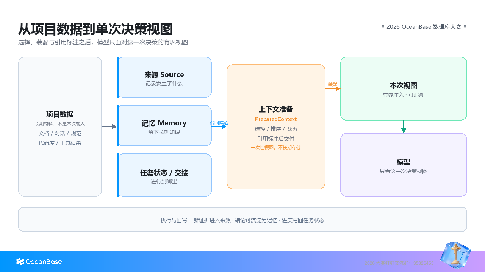

# I6：上下文工程概述

> Easy Data x AI 课程 · 产业应用篇 · 第 6 节

::: tip 本节定位
本节从跨会话继续任务的需要出发，介绍上下文的保存、选择、修订与交接，并通过 PowerContext 接入练习检查上下文是否进入请求、被 Agent 使用，以及是否改善任务结果。具体实现与接口边界将在 I7 中展开，场景化测评将在 I8 中展开。
:::

在新会话中继续项目，或把任务交给其他人、Agent 时，接手者需要找回已经确认的决定，了解工作推进到了哪里。上下文工程要在会话之外维护这些记录及其依据，让接手者核对当前状态后继续工作。本节用订单日报任务说明如何管理上下文，再通过 PowerContext 完成保存、跨会话读取和修订，检查这些信息是否帮助了任务。

实操选用 Codex 演示，也可以使用支持相应扩展机制的其他 Agent 工具。开始前，你需要有使用 Agent 的经验，并能执行基本的命令行操作。装配预算、历史版本和交接接口的进一步验证，安排在[《PowerContext 的设计与实现》](I7%20课程稿：PowerContext%20的设计与实现.md)中。

## 学习目标

学完本节，你将能够：

1. 解释提示词工程与上下文工程的分工，以及扩大上下文窗口为什么不能自动提高有效信息密度。
2. 区分来源、记忆、任务状态、上下文准备和交接，按任务选择材料并保留引用。
3. 通过插件接入 PowerContext，保存一条决定，在新会话中读取并修订它。
4. 检查上下文是否进入请求、是否被采用，以及它对任务质量、延迟和成本的影响。
5. 判断项目是否需要独立的上下文管理系统，以及先接入哪些功能。

## 1. 从上下文窗口到上下文管理

### 1.1 窗口容量解决不了信息选择

扩大上下文窗口能装入更多 Token，但不能自动提高有效信息密度。把更多材料放进请求时，重复、过期或互相矛盾的信息也可能随之进入。处理这些输入通常还会增加费用和等待时间，具体开销取决于模型、缓存和服务实现。

假设你正在用 Agent 开发订单日报。一份需求文档规定统计最近 7 天的退款，后来的评审将范围改为最近 14 天，聊天记录中还保留着最初的方案。即使这些材料都能放进窗口，Agent 仍需判断该采用哪条决定，并找到修改依据。

提示词工程帮助你把任务和约束说清楚。上下文工程还要解决材料如何进入请求的问题：哪些内容值得保存，何时读取，一次提供多少，出现冲突后怎样处理。工作需要跨会话继续时，就要在会话之外保存这些信息，并维护它们的状态。

### 1.2 工作越长，越需要保留已确认的信息

Agent 可以辅助完成一个步骤，也可以连续执行工作流，或与其他 Agent 分工合作。参与的步骤越多，需要参考的材料往往也越分散：需求在工单里，修改在代码仓库里，讨论和检查结果又保存在别处。接手任务时，Agent 需要重新找到这些信息。

订单日报任务换到新会话后，接手者可能只知道要生成报表，却不知道统计口径已经改过，也不清楚哪些检查已完成。重新读完整段对话很费时，还可能把讨论中的设想当成最终决定。

如果把当前决定、检查结果和待办事项保存在项目中，下一位参与者就有了明确的起点。即使换了人、Agent 或模型，也能先找到这些记录，核对当前状态后继续工作。

### 1.3 每次请求需要一个合适的视图

资料少时，把它们写进固定提示词很方便。随着项目推进，这种做法会越来越难维护：新旧规范混在一起，每次都要判断哪些仍然适用，也要检查剩余窗口是否足够完成任务。

一次请求通常只需要项目资料中的一部分，我们把这部分内容称为本次请求的视图。核对退款口径时，需要当前决定及其依据；排查报表生成失败时，则需要相关报错和代码。两个请求属于同一项目，所需材料却不同。

准备视图时，先确认任务必需的事实和约束，再去掉无关内容，并保留关键依据的出处。长期存储负责保存资料，上下文准备负责选择本次要用的部分。输入短一些可以减少开销，但漏掉退款口径这样的关键约束，会直接影响结果。



## 2. 上下文中的数据职责

### 2.1 五类数据职责

订单日报任务中的信息用途各不相同，可以分成以下几类：

| 数据职责 | 需要回答的问题 | 订单日报中的内容 |
| --- | --- | --- |
| 来源 | 这条信息来自哪里，有什么证据 | 需求文档、评审意见、检查输出 |
| 记忆 | 哪些结论值得在后续请求中复用 | 退款统计范围已经确定为 14 天 |
| 任务状态 | 工作推进到了哪里 | 查询已写好，结果尚未与样本核对 |
| 上下文准备 | 本次请求需要看到哪些内容 | 核对统计口径所需的当前决定和引用 |
| 交接 | 接手者需要知道什么才能继续 | 当前目标、已完成检查、缺口和下一步 |

来源保留证据，记忆保存以后还要用的结论。例如，完整的评审对话可以作为来源，而其中确认的退款范围适合保存为记忆。决定改变或不再适用时，需要修订或停用这条记忆。

记忆的提取、保存和召回实现，可以参阅[《Agent 开发与记忆系统》](../dev/D4%20课程稿：Agent%20开发与记忆系统.md)。

任务状态记录当前进度。把工作交给别人时，还要说明检查过什么、结果在哪里、哪些问题尚未解决，这些内容共同构成交接。任务完成后，当时的进度可以归档，后续仍要遵循的决定和可复用经验则继续保留。

PowerContext 用 Source 保存来源，用 Artifact 表示记忆、交接等产物，由 Trigger 决定相应处理。采集来源与生成记忆是分开的：一次讨论可以先保留为证据，等决定明确后，再整理为后续请求可用的内容。

### 2.2 用 Scope 保留工作范围

Scope 表示一组上下文所属的工作范围，`scope_id` 是它的标识。例如，为 Aurora 订单日报创建一个 Scope 后，今天和明天的会话都可以访问它。Session 表示一次会话；会话结束后，Scope 中保存的内容仍然存在。

接入工具时，把项目目录和会话绑定到服务生成的 Scope ID。需要独立保存另一个项目时，应创建或选择对应的 Scope；仅切换目录不一定会隔离数据。

使用 Scope 时，还要检查访问权限。Scope ID 用于选择资料范围，服务端另行判断调用者是否有权读取或修改其中的内容。

### 2.3 长期产物和本次视图

PowerContext 根据当前请求选择内容、限制输出大小，并附上引用，得到 `PreparedContext`，即准备好的上下文。它是本次请求的临时视图；下次请求可以根据新的问题重新准备。

交接则围绕接手后的工作组织材料，需要包含目标、已验证进度、阻塞和下一步。准备好交接内容后，还要检查它是否已经保存，以及接手者能否读取。可用记忆、一次请求的输入和一次交接有各自的完成条件。

## 3. 一次请求的上下文工作流程

### 3.1 从工作材料到任务反馈

从保存材料到继续工作，上下文通常经过以下处理。已有资料可以重复使用，因此每次请求不必重新执行全部步骤。

1. 明确当前任务，选择对应的 Scope。
2. 保存相关材料，记录需要复用的决定，或按配置生成产物。
3. 找出相关内容，检查版本、有效状态和访问权限。
4. 在预算内组织上下文，保留引用，并标明哪些内容来自历史记录。
5. 把准备好的内容加入模型请求，让 Agent 结合当前要求开展工作。
6. 检查任务结果，按需要修订记忆或保存交接。

如果你已经使用过 RAG，会对检索资料并放入生成请求的过程比较熟悉。跨会话工作还需要维护进度、版本和失效状态，帮助后续请求识别过时的结论。

### 3.2 先判断相关性，再控制大小

查找退款口径时，先用项目和任务缩小范围，再选择检索方式：

| 方式 | 适合的查询 | 主要限制 |
| --- | --- | --- |
| 全文检索 | 项目名、字段名、规范编号和错误码 | 用词不同时可能漏掉相关内容 |
| 向量检索 | 用不同措辞表达相近问题 | 需要向量模型，精确标识符仍需核对 |
| 混合检索 | 同时包含业务意图和明确术语 | 需要融合排序，并用实际任务检查效果 |

实现示例见[《AI 应用的数据层》](../dev/D2%20课程稿：AI%20应用的数据层.md)。

检索分数帮助判断相关性，不能代替可信度。选入上下文前，还要检查使用条件，这一步称为准入。即使旧口径排在第一位，也要确认它是否有效、有权访问。没有合适内容时可以返回空结果，排查时再区分未命中、条目停用和预算不足。

### 3.3 字节预算与 Token 预算分别核对

UTF-8 字节衡量文本大小，Token 用于计算模型窗口占用和用量，两者没有固定换算关系。PowerContext 用 `max_bytes` 限制准备结果；宿主仍需给当前指令、用户输入、工具信息和模型输出留下 Token 空间。

裁剪时保留关键约束和引用。比较预算效果时，固定资料版本、候选顺序和装配规则，避免把资料变化误认为裁剪差异。参数和响应验证见[《PowerContext 的设计与实现》](I7%20课程稿：PowerContext%20的设计与实现.md)。

Skill 也应按需加载。[《多 Skill 给上下文工程带来的麻烦：如何应对 Agent「爆上下文」》](../extra/X2%20多%20Skill%20给上下文工程带来的麻烦：如何应对%20Agent「爆上下文」.md)提供了与全量注入的对照练习。

### 3.4 引用、修订与冲突处理

精确引用定位到具体内容及版本。PowerContext 的 Memory 使用 `citation` 保存定位信息。退款范围从 7 天改为 14 天后，当前检索应采用新决定，旧引用仍能用于核查历史报表。

两份材料结论不同时，先核对适用范围和决定权限。不同团队的说明可能各自有效；确实需要选择一个结论时，再按下面的方式处理。

| 处理方式 | 适用条件与依据 |
| --- | --- |
| 采用已生效的修订 | 同一来源和范围，有明确修订关系；不能只比较记录时间 |
| 按来源可信度取舍 | 核对原始证据、确认者及权限；不能用检索分数代替可信度 |
| 请负责人确认 | 依据不足或影响较大时，提供双方引用、分歧和待确认事项 |

保留选择理由和确认者。决定有误时，读取旧版核对，再基于当前版本提交纠正。不再适用的条目可以停用，历史仍保留；彻底清理则需走删除流程。产品层的取舍见[《Agent 记忆系统设计》](../pm/P3%20课程稿：Agent%20记忆系统设计.md)。

经验和操作方法还可能需要审核。PowerContext 对 Experience 和受管理的 Skill 提案设有审核流程；本节练习采用显式 Memory 写入，由调用者确认要保存的决定。

### 3.5 历史资料的信任边界

旧交接写着可以发布报表，而当前用户只要求检查口径时，Agent 应完成检查，不应发布。历史资料需要保留出处和标记，宿主再按当前指令和权限使用。将历史文字放进请求，不会让它自动获得执行授权。

## 4. MCP、Skills 与 Agent Plugins 怎样配合

运行 Agent 的工具称为宿主，Codex 就是其中一种。接入 PowerContext 时，三种机制分别承担以下工作：

| 机制 | 本节中的作用 |
| --- | --- |
| MCP | 让宿主发现并调用 PowerContext 的记忆工具 |
| Skills | 通过 `SKILL.md` 及相关资源，指导 Agent 何时保存、搜索和修订，并检查结果 |
| Agent Plugins | 将 Skill、MCP 配置及宿主支持的 Hook 打包安装 |

MCP 传递调用，Server 保存和读取内容；安装插件后，仍需通过实际调用确认接入成功。格式与协议分别见 [MCP 架构说明](https://modelcontextprotocol.io/docs/2026-07-28/learn/architecture)、[Agent Skills 概述](https://agentskills.io/home)和 [OpenAI 插件文档](https://learn.chatgpt.com/docs/plugins#use-plugins-from-a-supported-surface)。

Codex 插件还通过 Hook 在会话启动时绑定 Scope、提交提示词时自动召回，并把准备结果交给宿主。换用其他工具时，可参考[可移植插件](https://github.com/oceanbase/powercontext/tree/powercontext-v1.0.0/integrations/agent-plugin/powercontext)，另行核对认证方式与 Hook 支持。

业务 Skill 指导怎样完成任务，PowerContext Skill 指导怎样管理上下文，可以配合使用。操作指导的组织与共享见[《Skill 与 Agent 知识管理》](../pm/P4%20课程稿：Skill%20与%20Agent%20知识管理.md)。

## 5. 动手练习：以 Codex 为例接入 PowerContext

下面使用 Codex CLI 完成一次跨会话记忆练习。换用其他支持 MCP 和 Skills 的宿主时，请按对应集成文档安装，并确认前后两个会话访问同一服务和 Scope。后面的保存、检索、修订及引用检查仍然适用。

### 5.1 准备环境

准备 macOS 或 Linux 的 Bash 终端、Python 3.11+、Git、curl 和 [uv](https://docs.astral.sh/uv/getting-started/installation/)，以及已登录、可正常对话的 Codex CLI。Windows 支持仍处于试验阶段，需要另行核对安装要求。

示例采用 [PowerContext 1.0.0](https://pypi.org/project/powercontext/1.0.0/) 和 Codex CLI 0.153.4。本次显式记忆练习无需为 PowerContext 配置生成或向量模型，Codex 本身仍需模型访问。用 `codex --version` 和 `codex plugin --help` 检查版本与插件入口。

服务仅在本机监听，不启用鉴权。8000 端口若被占用，请统一替换后续地址。从同一终端启动 Codex，让环境变量传入进程；桌面 App 需另行确认配置。Aurora 是虚构练习项目。

### 5.2 安装并启动 Server

在终端 A 执行并保持服务运行：

```bash
uv tool install "powercontext[cli,server]==1.0.0"
mkdir -p ~/powercontext-i6
cd ~/powercontext-i6
export POWERCONTEXT_HOME="$PWD/.powercontext"
powercontext server run --no-env-file --host 127.0.0.1 --port 8000
```

默认数据保存在练习目录的 `.powercontext` 中。`--no-env-file` 禁止自动读取环境文件，但已有环境变量仍生效；以前配置过 PowerContext 时，请核对数据库与连接设置。

另开终端 B 检查版本、就绪状态和能力：

```bash
cd ~/powercontext-i6
export POWERCONTEXT_CLIENT_SERVER_URL=http://127.0.0.1:8000
powercontext --version
powercontext doctor
powercontext ready
powercontext capabilities
```

版本应为 1.0.0，服务应已就绪。缺少生成或向量模型不影响本次显式记忆练习。

### 5.3 创建独立 Scope

在终端 B 创建练习范围。`idempotency_key` 用于识别重复请求，避免重复创建。

```bash
curl --fail --silent --show-error \
  --header 'Content-Type: application/json' \
  --data '{"title":"I6 Aurora lab","summary":"Order report context exercise","idempotency_key":"i6-aurora-lab"}' \
  http://127.0.0.1:8000/v1/scopes
```

将返回的 `scope_id` 填入变量：

```bash
export POWERCONTEXT_CODEX_SCOPE_ID='REPLACE_WITH_RETURNED_SCOPE_ID'
```

前后会话都使用同一服务和 ID。换终端后重新设置变量；需要空白数据时，更换幂等键创建新 Scope。

### 5.4 安装插件，检查 Skill 和 MCP

继续在终端 B 执行。安装会注册插件市场；遇到信任提示时，核对插件与 Hook 来源。

```bash
powercontext setup codex \
  --ref powercontext-v1.0.0 \
  --server-url http://127.0.0.1:8000
powercontext doctor codex
export POWERCONTEXT_CODEX_CAPTURE_PROMPTS=false
codex
```

这里关闭自动提示词采集，方便观察显式保存的记忆，自动召回仍可运行。更换服务地址后，重新执行 setup 并开启会话。配置详情见 [Codex 集成文档](https://github.com/oceanbase/powercontext/blob/powercontext-v1.0.0/docs/zh/docs/integrations/codex.md)。

进入 Codex 后，检查以下[内置命令](https://learn.chatgpt.com/docs/developer-commands#built-in-slash-commands)：

| 命令 | 预期结果 |
| --- | --- |
| `/plugins` | PowerContext 已启用；插件自身版本可显示为 0.2.0，与 Server 分别编号 |
| `/hooks` | 存在 `SessionStart`、`UserPromptSubmit` 和 `PreToolUse`；首次信任后重启会话，使 Scope 绑定生效 |
| `/mcp` | 已连接，能发现 `remember_memory`、`search_memory`、`get_memory_entry`、`revise_memory_entry` |
| `/skills` | 能找到并读取 [`project-context`](https://github.com/oceanbase/powercontext/blob/powercontext-v1.0.0/integrations/codex/plugins/powercontext/skills/project-context/SKILL.md) |

工具齐全后开始写入；缺项时先按[常见问题](#_7-2-常见问题)排查。

### 5.5 会话 A：显式保存一条决定

请 Codex 显示当前 `scope_id`，与创建时记录的值核对，再发送：

> 请使用 PowerContext 的 project-context Skill，在当前 Scope 保存这条决定：Aurora 订单日报统计最近 7 天的退款。kind 使用 decision，正文使用 `Aurora refund report covers the last 7 days.`。保存成功后，搜索 `Aurora refund report`，展示正文和完整 citation。

检查 `remember_memory` 调用成功，并复制搜索返回的完整 `citation`，保留其中的 `memory_ref`、`entry_id` 和 `entry_version_id`。工具名可能带命名空间前缀。真实项目还应保存对应需求或评审依据。

### 5.6 会话 B：通过 MCP 找回历史

用 `/quit` 退出，在同一终端重新运行 `codex`，创建新会话并保留 Scope 设置。不要使用 `codex resume`，也不要在问题里给出答案：

> 请通过 PowerContext 搜索当前 Scope 中的 `Aurora refund report`，mode 使用 auto，limit 使用 3。根据结果说明退款统计范围，并附上完整 citation。如果没有找到，请说明未找到。本次只读取记忆。

`search_memory` 应返回 7 天决定，citation 与笔记一致。未配置向量模型时，本例的 `auto` 使用全文检索，响应 `mode` 为 `fts`，因此查询保留了正文关键词。

即使 Hook 已提供答案，也完成一次显式搜索以核对 MCP；自动召回的结果另查 Hook 记录。

### 5.7 修订决定，再核对旧引用

继续在会话 B 发送以下请求，并附上笔记中的完整旧 citation：

> Aurora 的退款统计范围改为最近 14 天。请先读取当前条目，再用当前 citation 修订这条决定，正文改为 `Aurora refund report covers the last 14 days.`。修订后搜索确认结果，并用我附上的旧 citation 读取历史内容。

检查 `revise_memory_entry` 成功，当前搜索返回 14 天，条目 ID 不变、版本变化；`get_memory_entry` 使用旧 citation 时仍返回 7 天。若修订报版本冲突，重新读取当前条目，再决定如何修改，避免覆盖他人的更新。

### 5.8 观察自动召回

在同一 Scope 开启新会话，输入 `Aurora refund report 的退款范围？`。全文检索对用词敏感，先用短查询检查；整段操作要求可能导致自动召回为空。

回答正确后，仍要从 Hook 和会话记录区分它来自自动注入还是显式搜索。下一节分别检查这些证据。

## 6. 如何判断上下文帮助了任务

### 6.1 分别检查准备、注入、使用和收益

准备内容、交给宿主、用于回答和改善结果，各自需要证据，可以记为 `Prepared ≠ Injected ≠ Used ≠ Benefited`。

| 阶段 | 可检查的证据 |
| --- | --- |
| Prepared（已准备） | 响应中的正文、大小和引用符合请求要求 |
| Injected（已注入） | 实际模型请求或注入追踪确认这些内容进入了对应请求 |
| Used（已使用） | 回答采用正确口径，或操作遵循对应约束 |
| Benefited（有帮助） | 对照任务的正确率、返工次数、耗时和费用得到改善 |

Hook 成功返回，只能确认内容已交付宿主；看不到请求或注入追踪时，应把注入状态记为无法确认。回答虽附了新版引用却仍采用 7 天口径，也没有正确使用上下文。行为检查不能直接证明模型内部怎样处理了输入。

用下面的对照检查跨会话记忆的作用：

1. 按[创建独立 Scope](#_5-3-创建独立-scope)的步骤，更换名称和幂等键，创建空白 Scope，不设置 Parent 或上下文引用。
2. 在新终端将 `POWERCONTEXT_CODEX_SCOPE_ID` 设为这个 ID，设置 `POWERCONTEXT_CODEX_CAPTURE_PROMPTS=false`，启动 Codex 并发送[会话 B 的搜索请求](#_5-6-会话-b-通过-mcp-找回历史)。
3. 退出，改用原练习 Scope 的 ID，开启新会话，再发相同请求。两次均不提供答案，不续接旧会话。

空白 Scope 应返回未找到，原 Scope 应返回 14 天决定和引用。记录是否需要补充信息、是否采用旧口径及耗时。进一步评估项目收益时，还应固定模型、输入和判断标准，在多组任务上比较。费用计入检索、准备和额外模型调用，使用实际用量，插件的 Token 压缩估计只作参考。

### 6.2 找到影响结果的环节

沿信息的处理过程定位问题，可以避免在错误的环节反复调参：

| 环节 | 优先检查 |
| --- | --- |
| 收集与维护 | 决定是否真正保存，旧内容是否修订或停用 |
| 检索与准入 | 查询词、方式、Scope、访问权限和有效状态是否正确 |
| 装配与注入 | 是否超限或丢失引用，准备结果是否进入模型请求 |

决定从未保存时，调整检索也找不回来。修复后用原任务复查，最终仍以统计口径和报表结果为准。

### 6.3 在质量、延迟和成本之间取舍

分别记录检索、重排、装配和网络耗时，再调整候选数量、预算及重排开关。简单查询先限制候选；复杂任务需要更多证据时，扩大预算并观察错误是否减少。离线任务也可比较批量处理的成本。

订单日报可先读取已确认口径，核查时再按引用展开评审记录。摘要保留原文引用，缓存随修订和停用失效。评估时同时检查费用、实际命中和关键依据是否遗漏，避免只看到输入变短。

## 7. 检查练习结果

### 7.1 记录结果

保留安装检查、Scope ID、写入与修订的工具返回、两个会话的搜索结果，以及新旧 citation。它们应能说明：服务和工具已接通，新会话找回了决定，当前口径为 14 天，历史仍为 7 天。

另存 Hook 记录与任务对照，分别填写准备、注入、使用和收益的观察结果；无法确认的环节如实标明。

### 7.2 常见问题

| 现象 | 优先检查 |
| --- | --- |
| 找不到 `powercontext` | uv 工具目录是否加入 PATH，重开终端后检查 |
| MCP 无法连接或 Skill 缺失 | Server、地址和认证是否正确；插件是否完整加载，重启后检查 `/skills` |
| 写入后搜索为空，或两次会话结果不同 | 写入是否成功；Server、Scope 和绑定 Hook 是否一致；查询是否包含正文关键词 |
| 手动搜索成功，自动召回为空 | Hook 是否运行、准备结果是否为空；先用简短关键词检查全文匹配 |
| Source 已采集，Memory 未生成 | 是否配置提取所需的模型和规则；也可以先显式保存 |
| 修订冲突 | 引用是否过时，重新读取当前条目后处理 |

Agent 能正常对话不等于上下文服务已接通，仍需检查工具返回。

## 8. 从练习扩展到项目

只有少量材料时，在应用内组织上下文通常就够用。需要跨会话继续、多人共享决定或核对历史依据时，再考虑独立服务。它能减少多个 Agent 重复实现检索、修订和来源管理的工作，也增加部署与运维成本。

接入项目时，先选一条决定完成保存、读取和修订，再加入采集、交接或自动提取。更换宿主后，同一引用仍应读到同一版本，停用条目应退出当前搜索；生成的记忆应有来源依据。

团队协作还需约定目标和完成标准，交接已验证进度，并在任务结束后写回实际结果。需要复用经验和 Skill 时，再加入审核与分发。

保留练习环境，继续阅读[《PowerContext 的设计与实现》](I7%20课程稿：PowerContext%20的设计与实现.md)。下一章解释这些行为如何实现，并通过预算、交接和条目生命周期实验核对接口边界。
